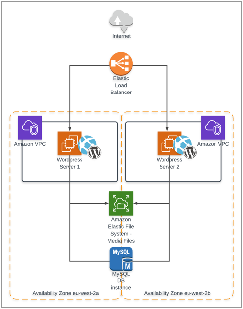

# Task



## The task is implemented using Terraform

## The following software versions are used:
- Terraform 1.1.7
- provider registry.terraform.io/hashicorp/aws v4.1.0

## Get and run

```
git clone https://github.com/demitov/DevOpsSchool.git

# Go to AWS directory
cd DevOpsSchool/AWS/

# Initialize terraform
terraform init

# Run apply
terraform apply
```

Then enter your AWS credetials (aws_access_key_id, aws_secret_access_key) and password to WordPress DB user

```
terraform apply
var.aws_access_key
  Your aws_access_key

  Enter a value: XXX

var.aws_secret_key
  Your aws_secret_key

  Enter a value: XXX

var.db_password
  Database user password

  Enter a value: XXX
```

After apply complite Outputs show Load Balancer web address
```
Outputs:

Balancer-Wordpress = "http://LoadBalancer-xxxxxxxxxx.eu-west-3.elb.amazonaws.com"
```

Go to the Load Balancer web address from output and refresh page, server name should change