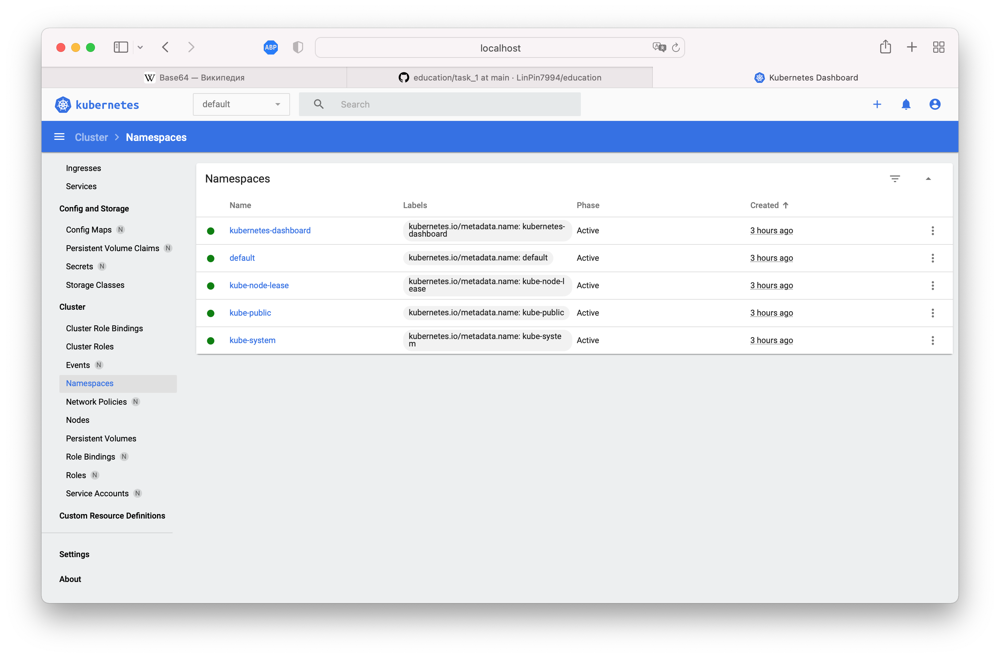

# Task #1

## Task #1.1

```
$ kubectl version --client

Client Version: version.Info{Major:"1", Minor:"22", GitVersion:"v1.22.5", GitCommit:"5c99e2ac2ff9a3c549d9ca665e7bc05a3e18f07e", GitTreeState:"clean", BuildDate:"2021-12-16T08:38:33Z", GoVersion:"go1.16.12", Compiler:"gc", Platform:"darwin/amd64"}
```

```
$ minikube start --driver=virtualbox

😄  minikube v1.25.2 on Darwin 11.6.5
✨  Using the virtualbox driver based on user configuration
👍  Starting control plane node minikube in cluster minikube
🔥  Creating virtualbox VM (CPUs=2, Memory=2200MB, Disk=20000MB) ...
🐳  Preparing Kubernetes v1.23.3 on Docker 20.10.12 ...
    ▪ kubelet.housekeeping-interval=5m
    ▪ Generating certificates and keys ...
    ▪ Booting up control plane ...
    ▪ Configuring RBAC rules ...
    ▪ Using image gcr.io/k8s-minikube/storage-provisioner:v5
🔎  Verifying Kubernetes components...
🌟  Enabled addons: storage-provisioner, default-storageclass
🏄  Done! kubectl is now configured to use "minikube" cluster and "default" namespace by default
```

```
$ kubectl cluster-info

Kubernetes control plane is running at https://192.168.59.101:8443
CoreDNS is running at https://192.168.59.101:8443/api/v1/namespaces/kube-system/services/kube-dns:dns/proxy

To further debug and diagnose cluster problems, use 'kubectl cluster-info dump'.
```

```
$ kubectl get nodes

NAME       STATUS   ROLES                  AGE   VERSION
minikube   Ready    control-plane,master   73s   v1.23.3
```

```
$ kubectl apply -f https://raw.githubusercontent.com/kubernetes/dashboard/master/aio/deploy/recommended.yaml

namespace/kubernetes-dashboard created
serviceaccount/kubernetes-dashboard created
service/kubernetes-dashboard created
secret/kubernetes-dashboard-certs created
secret/kubernetes-dashboard-csrf created
secret/kubernetes-dashboard-key-holder created
configmap/kubernetes-dashboard-settings created
role.rbac.authorization.k8s.io/kubernetes-dashboard created
clusterrole.rbac.authorization.k8s.io/kubernetes-dashboard created
rolebinding.rbac.authorization.k8s.io/kubernetes-dashboard created
clusterrolebinding.rbac.authorization.k8s.io/kubernetes-dashboard created
deployment.apps/kubernetes-dashboard created
service/dashboard-metrics-scraper created
deployment.apps/dashboard-metrics-scraper created
```

```
kubectl get pod -n kubernetes-dashboard
NAME                                         READY   STATUS    RESTARTS   AGE
dashboard-metrics-scraper-799d786dbf-j6sbf   1/1     Running   0          38s
kubernetes-dashboard-fb8648fd9-sxx4c         1/1     Running   0          38s
```

```
$ kubectl apply -f https://github.com/kubernetes-sigs/metrics-server/releases/latest/download/components.yaml

serviceaccount/metrics-server created
clusterrole.rbac.authorization.k8s.io/system:aggregated-metrics-reader created
clusterrole.rbac.authorization.k8s.io/system:metrics-server created
rolebinding.rbac.authorization.k8s.io/metrics-server-auth-reader created
clusterrolebinding.rbac.authorization.k8s.io/metrics-server:system:auth-delegator created
clusterrolebinding.rbac.authorization.k8s.io/system:metrics-server created
service/metrics-server created
deployment.apps/metrics-server created
apiservice.apiregistration.k8s.io/v1beta1.metrics.k8s.io created
```

```
$ kubectl edit -n kube-system deployment metrics-server
```

Edit yaml in editor:
```
spec:
      containers:
      - args:
        - --cert-dir=/tmp
        - --secure-port=443
        - --kubelet-preferred-address-types=InternalIP,ExternalIP,Hostname
        - --kubelet-insecure-tls
        - --kubelet-use-node-status-port```
```
```
deployment.apps/metrics-server edited
```

```
$ kubectl describe sa -n kube-system default

Name:                default
Namespace:           kube-system
Labels:              <none>
Annotations:         <none>
Image pull secrets:  <none>
Mountable secrets:   default-token-8hjv4
Tokens:              default-token-8hjv4
Events:              <none>
```

```
$ kubectl get secrets -n kube-system

NAME                                             TYPE                                  DATA   AGE
attachdetach-controller-token-9nfs5              kubernetes.io/service-account-token   3      10m
bootstrap-signer-token-vvpsh                     kubernetes.io/service-account-token   3      10m
bootstrap-token-8se4da                           bootstrap.kubernetes.io/token         6      10m
certificate-controller-token-d89nb               kubernetes.io/service-account-token   3      10m
clusterrole-aggregation-controller-token-kxvd7   kubernetes.io/service-account-token   3      10m
coredns-token-fqvfg                              kubernetes.io/service-account-token   3      10m
cronjob-controller-token-96xkr                   kubernetes.io/service-account-token   3      10m
daemon-set-controller-token-n944s                kubernetes.io/service-account-token   3      10m
default-token-8hjv4                              kubernetes.io/service-account-token   3      10m
deployment-controller-token-r7vzb                kubernetes.io/service-account-token   3      10m
disruption-controller-token-5v4zq                kubernetes.io/service-account-token   3      10m
endpoint-controller-token-jzm22                  kubernetes.io/service-account-token   3      10m
endpointslice-controller-token-wfs4r             kubernetes.io/service-account-token   3      10m
endpointslicemirroring-controller-token-lxm7k    kubernetes.io/service-account-token   3      10m
ephemeral-volume-controller-token-nmnf9          kubernetes.io/service-account-token   3      10m
expand-controller-token-hlk4b                    kubernetes.io/service-account-token   3      10m
generic-garbage-collector-token-59xt5            kubernetes.io/service-account-token   3      10m
horizontal-pod-autoscaler-token-hmm7h            kubernetes.io/service-account-token   3      10m
job-controller-token-jqxvn                       kubernetes.io/service-account-token   3      10m
kube-proxy-token-dx82n                           kubernetes.io/service-account-token   3      10m
metrics-server-token-x8st7                       kubernetes.io/service-account-token   3      6m27s
namespace-controller-token-2lqzb                 kubernetes.io/service-account-token   3      10m
node-controller-token-5t8fp                      kubernetes.io/service-account-token   3      10m
persistent-volume-binder-token-22rpz             kubernetes.io/service-account-token   3      10m
pod-garbage-collector-token-pn7wx                kubernetes.io/service-account-token   3      10m
pv-protection-controller-token-vlkj7             kubernetes.io/service-account-token   3      10m
pvc-protection-controller-token-jxqtx            kubernetes.io/service-account-token   3      10m
replicaset-controller-token-5w8f2                kubernetes.io/service-account-token   3      10m
replication-controller-token-hrp4c               kubernetes.io/service-account-token   3      10m
resourcequota-controller-token-rc7dc             kubernetes.io/service-account-token   3      10m
root-ca-cert-publisher-token-2llbc               kubernetes.io/service-account-token   3      10m
service-account-controller-token-8h4z6           kubernetes.io/service-account-token   3      10m
service-controller-token-9hrcl                   kubernetes.io/service-account-token   3      10m
statefulset-controller-token-pf7tr               kubernetes.io/service-account-token   3      10m
storage-provisioner-token-2hm89                  kubernetes.io/service-account-token   3      10m
token-cleaner-token-t8xt7                        kubernetes.io/service-account-token   3      10m
ttl-after-finished-controller-token-dshdf        kubernetes.io/service-account-token   3      10m
ttl-controller-token-v4mf5                       kubernetes.io/service-account-token   3      10m
```

```
kubectl get secrets -n kube-system metrics-server-token-x8st7 -o yaml

apiVersion: v1
data:
  ca.crt: LS0tLS1CRUdJTiBDRVJUSUZJQ0FURS0tLS0tCk1JSURCakNDQWU2Z0F3SUJBZ0lCQVRBTkJna3Foa2lHOXcwQkFRc0ZBREFWTVJNd0VRWURWUVFERXdwdGFXNXAKYTNWaVpVTkJNQjRYRFRJeU1ERXhPVEUwTWpFMU5Wb1hEVE15TURFeE9ERTBNakUxTlZvd0ZURVRNQkVHQTFVRQpBeE1LYldsdWFXdDFZbVZEUVRDQ0FTSXdEUVlKS29aSWh2Y05BUUVCQlFBRGdnRVBBRENDQVFvQ2dnRUJBTDRDCnQrV1pHSDFIWGNKYi9OTlU4NUtNdGhtdDhlQ1BtUXJVdUphRGJrWFcwWmppWndoeWFibDRWOXRCcWYwd2ZRbjAKck1Bc2lDdzNoZGhlTVBqb1hkQnpPU1JJcjkyRWxSMnkyRlh4TmhhMGgwYktsSVYvUG9ydExtZXZqczRTN0dNLwoxaDYzTUtkNFBHUFJkL2hDT1MxSmhsUVRWdlRuK29QdFR0ZWNBRU9VOElnbjg0K3FPTmdNYWgvTHZwdm5jZmlPClRISkExajFQRm1IZEgwb0RtNzNCYkpDSTJ5U1lnODJySTYrbE5iaUY4N3BwZ2U3S0dGNXhOZW9xZmw4S0g1dncKcHhWM2F0OE0wWk9zZENtWDlJaDI3aVBQQ3JOVFIzdUZrdU80Y1hSZWtBMms2Q1ZjcFRvTThLTExvV294YmRNMgpmeitHV1R3N2F2OHdZOTVNd1pzQ0F3RUFBYU5oTUY4d0RnWURWUjBQQVFIL0JBUURBZ0trTUIwR0ExVWRKUVFXCk1CUUdDQ3NHQVFVRkJ3TUNCZ2dyQmdFRkJRY0RBVEFQQmdOVkhSTUJBZjhFQlRBREFRSC9NQjBHQTFVZERnUVcKQkJRL2E0Sks1aXNPMDAvMU5oaGZjYUZ0ZVhuTVdEQU5CZ2txaGtpRzl3MEJBUXNGQUFPQ0FRRUFxb3NrREV0agpuck9yV25XVWkrU3FBTlJ1UzhNVWV0VDBGc0FBWlhkblRMREJSRnpmMlZ3WGpoTm5uZktaTnNFMFNOTW9YOEJjCjdydUc5RGZwc05keVBkajA4alQrSGwxS1N5UGZESm1DS2p6c0U1dDl2SEc0NTFwRkJkTXFrcEsxRlAxbFpISnMKcFBvNmMwQVE0TXdNUUd1bjM2TGE1T0N6TkNkNmpiY1VoYUhQZkVySkhQZzRHbUFTZnV5RFcvdHRiLzdYSmFzUQp0ZmJMVjRnUUs1ZHdWa043OE5abmF4UlFiRHJmcHFaZUtzaG5zOUk4OXZzUG5WZ1lRdUMwdkNyK3MzV3ZDN3MrCis4OU41NWE4UFFkQitDUDVXSnBOZnQyUUtrSHh0WGhRMi9nRlJRWUZTaWFyY012S2owOGRYZEc5eUFwSjNIMGEKb0RFZTM5aHB0V25pb1E9PQotLS0tLUVORCBDRVJUSUZJQ0FURS0tLS0tCg==
  namespace: a3ViZS1zeXN0ZW0=
  token: ZXlKaGJHY2lPaUpTVXpJMU5pSXNJbXRwWkNJNklsVlNRMng2VFVSdFYzRm5NM2MyU1dORFNYbFBWVk56ZWxscmVFRnVUbE5KYTB4aVJFVnNPV2R5VG5jaWZRLmV5SnBjM01pT2lKcmRXSmxjbTVsZEdWekwzTmxjblpwWTJWaFkyTnZkVzUwSWl3aWEzVmlaWEp1WlhSbGN5NXBieTl6WlhKMmFXTmxZV05qYjNWdWRDOXVZVzFsYzNCaFkyVWlPaUpyZFdKbExYTjVjM1JsYlNJc0ltdDFZbVZ5Ym1WMFpYTXVhVzh2YzJWeWRtbGpaV0ZqWTI5MWJuUXZjMlZqY21WMExtNWhiV1VpT2lKdFpYUnlhV056TFhObGNuWmxjaTEwYjJ0bGJpMTRPSE4wTnlJc0ltdDFZbVZ5Ym1WMFpYTXVhVzh2YzJWeWRtbGpaV0ZqWTI5MWJuUXZjMlZ5ZG1salpTMWhZMk52ZFc1MExtNWhiV1VpT2lKdFpYUnlhV056TFhObGNuWmxjaUlzSW10MVltVnlibVYwWlhNdWFXOHZjMlZ5ZG1salpXRmpZMjkxYm5RdmMyVnlkbWxqWlMxaFkyTnZkVzUwTG5WcFpDSTZJalkwTWpZek5tRTFMVE0zTUdVdE5HVTRaQzFoWW1KaUxUWmlOR0kzT0dZM1pXTm1ZeUlzSW5OMVlpSTZJbk41YzNSbGJUcHpaWEoyYVdObFlXTmpiM1Z1ZERwcmRXSmxMWE41YzNSbGJUcHRaWFJ5YVdOekxYTmxjblpsY2lKOS5SZE5mWnBUM2VQb3BsaUM3U2hMZnlJQ0poSk11NHZhblExZ2FEYWtpTTNoazlpWWo0SFRmZVpHWnBnOUtPb0tab05sY3lsdF8zR1RZa3hKYjJ3aDRlWUV1VWRVWGJVSjJUTEc2U0FVTnVqcVZabDdvUGRHNGFqbjA0cllWOEduQ3gteXd4WFNGT1RscnpzUTk5Q0UtNlp4Nml5V1p3ZE95emJhdzZDWEZudmlFZmZzTWVVd2hsemdHR2FXRkFHc21GSlc2MkJZUjc5akNVUTVrbW5wVmZlMXpfV2FkQ0NLang3LXRMQXlBMk5yX19NR05iWkFTN3dLTmpTQnBsYUtmVVJkZnN0Sk9KTnc0ZzhqTmxub2hPbUJYSWJ4MEwteDc3SENkZXJaNllod0c2MjBOVGl5Wm15WEdZa2xVc1Zuc0ZRaXkyckNtWDhjd2k0RmZJWWVmc3c=
kind: Secret
metadata:
  annotations:
    kubernetes.io/service-account.name: metrics-server
    kubernetes.io/service-account.uid: 642636a5-370e-4e8d-abbb-6b4b78f7ecfc
  creationTimestamp: "2022-03-28T08:37:21Z"
  name: metrics-server-token-x8st7
  namespace: kube-system
  resourceVersion: "704"
  uid: 3f64a307-cc07-431a-82d2-d79751f63cad
type: kubernetes.io/service-account-token
```

```
$ echo -n ZXlKaGJHY2lPaUpTVXpJMU5pSXNJbXRwWkNJNklsVlNRMng2VFVSdFYzRm5NM2MyU1dORFNYbFBWVk56ZWxscmVFRnVUbE5KYTB4aVJFVnNPV2R5VG5jaWZRLmV5SnBjM01pT2lKcmRXSmxjbTVsZEdWekwzTmxjblpwWTJWaFkyTnZkVzUwSWl3aWEzVmlaWEp1WlhSbGN5NXBieTl6WlhKMmFXTmxZV05qYjNWdWRDOXVZVzFsYzNCaFkyVWlPaUpyZFdKbExYTjVjM1JsYlNJc0ltdDFZbVZ5Ym1WMFpYTXVhVzh2YzJWeWRtbGpaV0ZqWTI5MWJuUXZjMlZqY21WMExtNWhiV1VpT2lKdFpYUnlhV056TFhObGNuWmxjaTEwYjJ0bGJpMTRPSE4wTnlJc0ltdDFZbVZ5Ym1WMFpYTXVhVzh2YzJWeWRtbGpaV0ZqWTI5MWJuUXZjMlZ5ZG1salpTMWhZMk52ZFc1MExtNWhiV1VpT2lKdFpYUnlhV056TFhObGNuWmxjaUlzSW10MVltVnlibVYwWlhNdWFXOHZjMlZ5ZG1salpXRmpZMjkxYm5RdmMyVnlkbWxqWlMxaFkyTnZkVzUwTG5WcFpDSTZJalkwTWpZek5tRTFMVE0zTUdVdE5HVTRaQzFoWW1KaUxUWmlOR0kzT0dZM1pXTm1ZeUlzSW5OMVlpSTZJbk41YzNSbGJUcHpaWEoyYVdObFlXTmpiM1Z1ZERwcmRXSmxMWE41YzNSbGJUcHRaWFJ5YVdOekxYTmxjblpsY2lKOS5SZE5mWnBUM2VQb3BsaUM3U2hMZnlJQ0poSk11NHZhblExZ2FEYWtpTTNoazlpWWo0SFRmZVpHWnBnOUtPb0tab05sY3lsdF8zR1RZa3hKYjJ3aDRlWUV1VWRVWGJVSjJUTEc2U0FVTnVqcVZabDdvUGRHNGFqbjA0cllWOEduQ3gteXd4WFNGT1RscnpzUTk5Q0UtNlp4Nml5V1p3ZE95emJhdzZDWEZudmlFZmZzTWVVd2hsemdHR2FXRkFHc21GSlc2MkJZUjc5akNVUTVrbW5wVmZlMXpfV2FkQ0NLang3LXRMQXlBMk5yX19NR05iWkFTN3dLTmpTQnBsYUtmVVJkZnN0Sk9KTnc0ZzhqTmxub2hPbUJYSWJ4MEwteDc3SENkZXJaNllod0c2MjBOVGl5Wm15WEdZa2xVc1Zuc0ZRaXkyckNtWDhjd2k0RmZJWWVmc3c= | base64 -d

eyJhbGciOiJSUzI1NiIsImtpZCI6IlVSQ2x6TURtV3FnM3c2SWNDSXlPVVNzellreEFuTlNJa0xiREVsOWdyTncifQ.eyJpc3MiOiJrdWJlcm5ldGVzL3NlcnZpY2VhY2NvdW50Iiwia3ViZXJuZXRlcy5pby9zZXJ2aWNlYWNjb3VudC9uYW1lc3BhY2UiOiJrdWJlLXN5c3RlbSIsImt1YmVybmV0ZXMuaW8vc2VydmljZWFjY291bnQvc2VjcmV0Lm5hbWUiOiJtZXRyaWNzLXNlcnZlci10b2tlbi14OHN0NyIsImt1YmVybmV0ZXMuaW8vc2VydmljZWFjY291bnQvc2VydmljZS1hY2NvdW50Lm5hbWUiOiJtZXRyaWNzLXNlcnZlciIsImt1YmVybmV0ZXMuaW8vc2VydmljZWFjY291bnQvc2VydmljZS1hY2NvdW50LnVpZCI6IjY0MjYzNmE1LTM3MGUtNGU4ZC1hYmJiLTZiNGI3OGY3ZWNmYyIsInN1YiI6InN5c3RlbTpzZXJ2aWNlYWNjb3VudDprdWJlLXN5c3RlbTptZXRyaWNzLXNlcnZlciJ9.RdNfZpT3ePopliC7ShLfyICJhJMu4vanQ1gaDakiM3hk9iYj4HTfeZGZpg9KOoKZoNlcylt_3GTYkxJb2wh4eYEuUdUXbUJ2TLG6SAUNujqVZl7oPdG4ajn04rYV8GnCx-ywxXSFOTlrzsQ99CE-6Zx6iyWZwdOyzbaw6CXFnviEffsMeUwhlzgGGaWFAGsmFJW62BYR79jCUQ5kmnpVfe1z_WadCCKjx7-tLAyA2Nr__MGNbZAS7wKNjSBplaKfURdfstJOJNw4g8jNlnohOmBXIbx0L-x77HCderZ6YhwG620NTiyZmyXGYklUsVnsFQiy2rCmX8cwi4FfIYefsw
```

```
$ kubectl proxy
Starting to serve on 127.0.0.1:8001
```





## Task 1.2

```
$ kubectl run web --image=nginx:latest
pod/web created

$ kubectl get pods
NAME   READY   STATUS              RESTARTS   AGE
web    0/1     ContainerCreating   0          20s

$ kubectl get pods
NAME   READY   STATUS    RESTARTS   AGE
web    1/1     Running   0          80s
```


```
$ minikube ssh
                         _             _            
            _         _ ( )           ( )           
  ___ ___  (_)  ___  (_)| |/')  _   _ | |_      __  
/' _ ` _ `\| |/' _ `\| || , <  ( ) ( )| '_`\  /'__`\
| ( ) ( ) || || ( ) || || |\`\ | (_) || |_) )(  ___/
(_) (_) (_)(_)(_) (_)(_)(_) (_)`\___/'(_,__/'`\____)

$ docker container ls
CONTAINER ID   IMAGE                                      COMMAND                  CREATED          STATUS          PORTS     NAMES
f4ac8b4e1283   nginx                                      "/docker-entrypoint.…"   15 minutes ago   Up 15 minutes             k8s_web_web_default_75619755-7152-47bd-8fe8-94584f3822a0_0
5f6e3868f6b0   k8s.gcr.io/pause:3.6                       "/pause"                 15 minutes ago   Up 15 minutes             k8s_POD_web_default_75619755-7152-47bd-8fe8-94584f3822a0_0
2f1c2a72bbe7   k8s.gcr.io/pause:3.6                       "/pause"                 4 hours ago      Up 4 hours                k8s_POD_metrics-server-79c47b44bf-xzvxc_kube-system_ef09cd70-687e-491e-b540-46906a901f8a_0
2087c3c363b7   k8s.gcr.io/metrics-server/metrics-server   "/metrics-server --c…"   4 hours ago      Up 4 hours                k8s_metrics-server_metrics-server-847dcc659d-ckf5w_kube-system_974fcb51-bda2-42be-a38f-5aeca553c976_0
174e13809f28   k8s.gcr.io/pause:3.6                       "/pause"                 4 hours ago      Up 4 hours                k8s_POD_metrics-server-847dcc659d-ckf5w_kube-system_974fcb51-bda2-42be-a38f-5aeca553c976_0
a5e1316c42b7   kubernetesui/dashboard                     "/dashboard --insecu…"   4 hours ago      Up 4 hours                k8s_kubernetes-dashboard_kubernetes-dashboard-fb8648fd9-sxx4c_kubernetes-dashboard_1a18e477-340c-4092-a653-a78a86a4b72b_0
c248c65c943b   7801cfc6d5c0                               "/metrics-sidecar"       4 hours ago      Up 4 hours                k8s_dashboard-metrics-scraper_dashboard-metrics-scraper-799d786dbf-j6sbf_kubernetes-dashboard_2e524458-a1d4-4288-990d-4fc034bf6154_0
2219e0f3bd03   k8s.gcr.io/pause:3.6                       "/pause"                 4 hours ago      Up 4 hours                k8s_POD_dashboard-metrics-scraper-799d786dbf-j6sbf_kubernetes-dashboard_2e524458-a1d4-4288-990d-4fc034bf6154_0
eb34039dce7e   k8s.gcr.io/pause:3.6                       "/pause"                 4 hours ago      Up 4 hours                k8s_POD_kubernetes-dashboard-fb8648fd9-sxx4c_kubernetes-dashboard_1a18e477-340c-4092-a653-a78a86a4b72b_0
6804d66b05c0   6e38f40d628d                               "/storage-provisioner"   4 hours ago      Up 4 hours                k8s_storage-provisioner_storage-provisioner_kube-system_0eb290c7-7b33-4bd6-9732-239dd3f9a221_1
6cd695a22e1f   a4ca41631cc7                               "/coredns -conf /etc…"   4 hours ago      Up 4 hours                k8s_coredns_coredns-64897985d-9z8kp_kube-system_3443ece9-1ea2-4209-8b04-ff266f520af0_0
1a406db8db54   9b7cc9982109                               "/usr/local/bin/kube…"   4 hours ago      Up 4 hours                k8s_kube-proxy_kube-proxy-q44lr_kube-system_99250748-c982-4947-9155-890156962a34_0
9d60ee2bf07c   k8s.gcr.io/pause:3.6                       "/pause"                 4 hours ago      Up 4 hours                k8s_POD_coredns-64897985d-9z8kp_kube-system_3443ece9-1ea2-4209-8b04-ff266f520af0_0
2ccd41065b58   k8s.gcr.io/pause:3.6                       "/pause"                 4 hours ago      Up 4 hours                k8s_POD_kube-proxy-q44lr_kube-system_99250748-c982-4947-9155-890156962a34_0
76b00404c39b   k8s.gcr.io/pause:3.6                       "/pause"                 4 hours ago      Up 4 hours                k8s_POD_storage-provisioner_kube-system_0eb290c7-7b33-4bd6-9732-239dd3f9a221_0
5f6b9bc337dd   99a3486be4f2                               "kube-scheduler --au…"   4 hours ago      Up 4 hours                k8s_kube-scheduler_kube-scheduler-minikube_kube-system_be132fe5c6572cb34d93f5e05ce2a540_0
95a03b83a825   b07520cd7ab7                               "kube-controller-man…"   4 hours ago      Up 4 hours                k8s_kube-controller-manager_kube-controller-manager-minikube_kube-system_587a73e23652b9545f6dd4342aff032b_0
d22f496d9a43   25f8c7f3da61                               "etcd --advertise-cl…"   4 hours ago      Up 4 hours                k8s_etcd_etcd-minikube_kube-system_74532e06f67e119ce1a5dc3ee7d2206b_0
cb6bc14198e1   f40be0088a83                               "kube-apiserver --ad…"   4 hours ago      Up 4 hours                k8s_kube-apiserver_kube-apiserver-minikube_kube-system_155a824721f5c67724f3218465dd9080_0
f0eca318a604   k8s.gcr.io/pause:3.6                       "/pause"                 4 hours ago      Up 4 hours                k8s_POD_kube-scheduler-minikube_kube-system_be132fe5c6572cb34d93f5e05ce2a540_0
0c817ce99eab   k8s.gcr.io/pause:3.6                       "/pause"                 4 hours ago      Up 4 hours                k8s_POD_kube-controller-manager-minikube_kube-system_587a73e23652b9545f6dd4342aff032b_0
c1c181f08092   k8s.gcr.io/pause:3.6                       "/pause"                 4 hours ago      Up 4 hours                k8s_POD_kube-apiserver-minikube_kube-system_155a824721f5c67724f3218465dd9080_0
61041e81edc3   k8s.gcr.io/pause:3.6                       "/pause"                 4 hours ago      Up 4 hours                k8s_POD_etcd-minikube_kube-system_74532e06f67e119ce1a5dc3ee7d2206b_0
```

```
$ kubectl explain pods.spec
KIND:     Pod
VERSION:  v1

RESOURCE: spec <Object>

DESCRIPTION:
     Specification of the desired behavior of the pod. More info:
     https://git.k8s.io/community/contributors/devel/sig-architecture/api-conventions.md#spec-and-status

     PodSpec is a description of a pod.
...
```

```
$ kubectl apply -f pod.yaml
pod/nginx created

$ kubectl apply -f rs.yaml
replicaset.apps/webreplica created
```

```
$ kubectl get pods
NAME               READY   STATUS    RESTARTS   AGE
nginx              1/1     Running   0          8m36s
web                1/1     Running   0          3h21m
webreplica-w99gv   1/1     Running   0          14s
```

```
$ kubectl run web --image=nginx:latest --dry-run=client -o yaml
apiVersion: v1
kind: Pod
metadata:
  creationTimestamp: null
  labels:
    run: web
  name: web
spec:
  containers:
  - image: nginx:latest
    name: web
    resources: {}
  dnsPolicy: ClusterFirst
  restartPolicy: Always
status: {}
```

# Homework

```
$ kubectl apply -f deployment-nginx.yaml
deployment.apps/nginx-deployment created

$ kubectl get pods
NAME                               READY   STATUS    RESTARTS   AGE
nginx                              1/1     Running   0          79m
nginx-deployment-8d545c96d-9b2mq   1/1     Running   0          91s
nginx-deployment-8d545c96d-rk6qf   1/1     Running   0          91s
web                                1/1     Running   0          4h32m
webreplica-w99gv                   1/1     Running   0          71m

$ kubectl delete pod nginx-deployment-8d545c96d-9b2mq
pod "nginx-deployment-8d545c96d-9b2mq" deleted

$ kubectl get pods
NAME                               READY   STATUS    RESTARTS   AGE
nginx                              1/1     Running   0          80m
nginx-deployment-8d545c96d-4rsrb   1/1     Running   0          9s
nginx-deployment-8d545c96d-rk6qf   1/1     Running   0          118s
web                                1/1     Running   0          4h32m
webreplica-w99gv                   1/1     Running   0          71m
```
