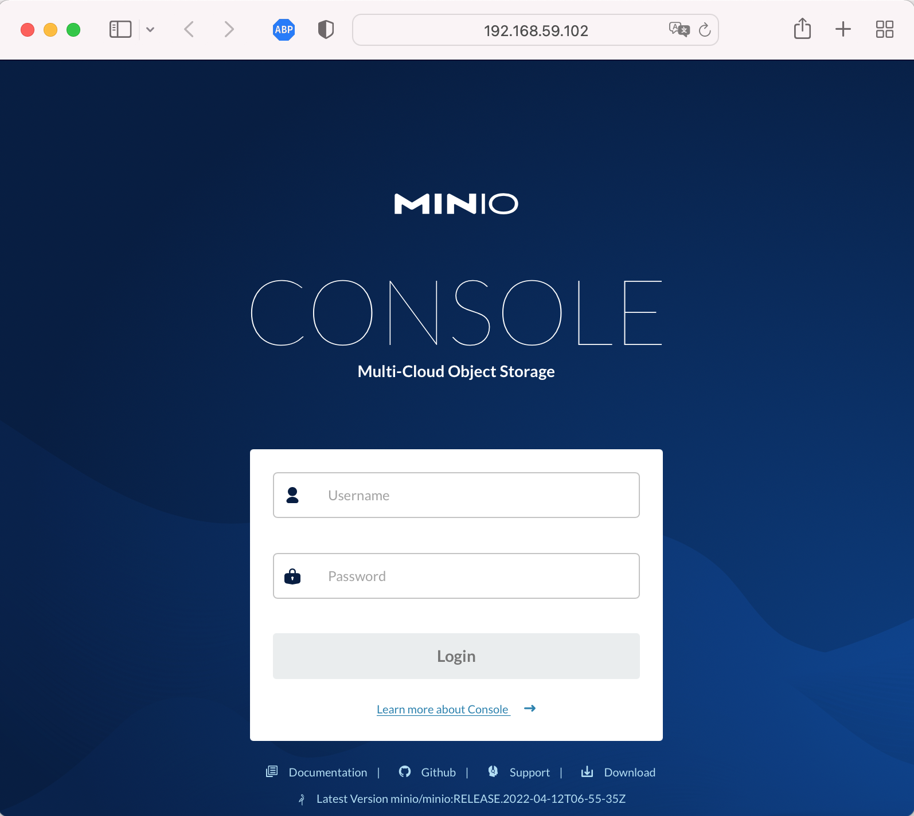

# Task 3

Create pv in kubernetes
```
$ kubectl apply -f pv.yaml
persistentvolume/minio-deployment-pv created

$ kubectl get pv
NAME                  CAPACITY   ACCESS MODES   RECLAIM POLICY   STATUS      CLAIM   STORAGECLASS   REASON   AGE
minio-deployment-pv   5Gi        RWO            Retain           Available                                   40s
```
Create persistent volume claim
```
$ kubectl apply -f pvc.yaml
persistentvolumeclaim/minio-deployment-claim created
$ kubectl get pv
NAME                  CAPACITY   ACCESS MODES   RECLAIM POLICY   STATUS   CLAIM                            STORAGECLASS   REASON   AGE
minio-deployment-pv   5Gi        RWO            Retain           Bound    default/minio-deployment-claim                           3m58s
$ kubectl get pvc
NAME                     STATUS   VOLUME                CAPACITY   ACCESS MODES   STORAGECLASS   AGE
minio-deployment-claim   Bound    minio-deployment-pv   5Gi        RWO                           95s
```

Apply deployment minio
```
$ kubectl apply -f deployment.yaml 
deployment.apps/minio created
```
Apply svc nodeport
```
$ kubectl apply -f minio-nodeport.yaml
service/minio-app created
```
Open in browser address $(minikube ip):30008


Apply statefulset
```
$ kubectl apply -f statefulset.yaml
statefulset.apps/minio-state created
service/minio-state created
```
Check pods and statefulset
```
$ kubectl get pods
NAME                    READY   STATUS    RESTARTS   AGE
minio-94fd47554-8fm8v   1/1     Running   0          11m
minio-state-0           1/1     Running   0          49s
$ kubectl get sts 
NAME          READY   AGE
minio-state   1/1     60s
```

# Homework
* We published minio "outside" using nodePort. Do the same but using ingress.
```
$ kubectl apply -f minio-ingress.yaml                 
service/minio-ingress-svc created
ingress.networking.k8s.io/minio-ingress created
```
Open in browser address $(minikube ip)


* Publish minio via ingress so that minio by ip_minikube and nginx returning hostname (previous job) by path ip_minikube/web are available at the same time.

Add to minio-ingress.yaml path /web to web-headless service
```
$ kubectl apply -f minio-ingress.yaml
service/minio-ingress-svc configured
ingress.networking.k8s.io/minio-ingress configured
```

* Create deploy with emptyDir save data to mountPoint emptyDir, delete pods, check data.
Create deployment-emptydir.yaml file and apply it
```
$ kubectl apply -f deployment-emptydir.yaml                 
deployment.apps/deployment-emptydir created

$ kubectl get deployments      
NAME                  READY   UP-TO-DATE   AVAILABLE   AGE
deployment-emptydir   1/1     1            1           30s

$ kubectl get pods
NAME                                   READY   STATUS    RESTARTS      AGE
deployment-emptydir-54cc56b88b-p8rql   1/1     Running   0             2m9s

$ kubectl exec deployment-emptydir-54cc56b88b-p8rql -it cat /var/emptydir/file.txt
Wed Apr 13 13:41:07 UTC 2022
Wed Apr 13 13:41:12 UTC 2022
Wed Apr 13 13:41:17 UTC 2022
...

kubectl delete pod deployment-emptydir-54cc56b88b-p8rql 
pod "deployment-emptydir-54cc56b88b-p8rql" deleted

$ kubectl get pods                                             
NAME                                   READY   STATUS    RESTARTS      AGE
deployment-emptydir-54cc56b88b-txcwf   1/1     Running   0             10m

$ kubectl exec deployment-emptydir-54cc56b88b-txcwf -it cat /var/emptydir/file.txt
Wed Apr 13 13:49:34 UTC 2022
Wed Apr 13 13:49:39 UTC 2022
Wed Apr 13 13:49:44 UTC 2022
...
```

* Optional. Raise an nfs share on a remote machine. Create a pv using this share, create a pvc for it, create a deployment. Save data to the share, delete the deployment, delete the pv/pvc, check that the data is safe.